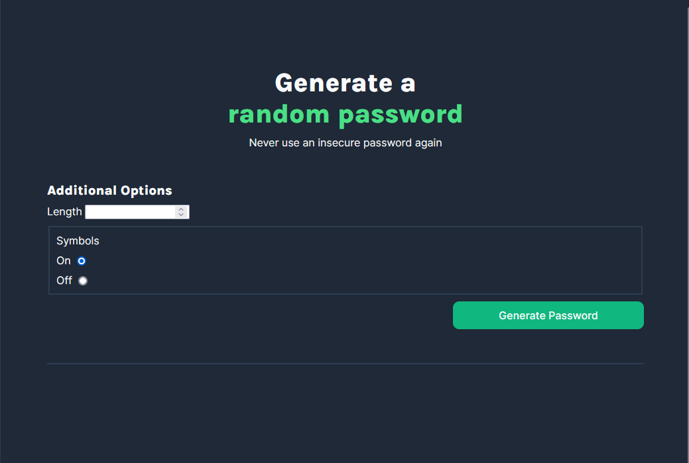
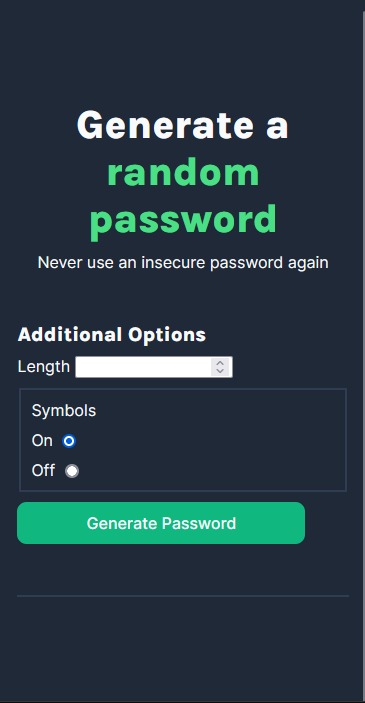
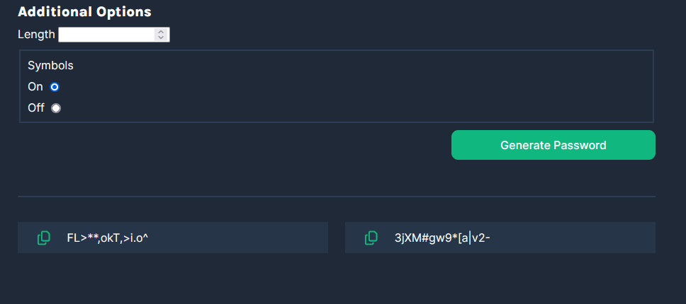

# 🔐 Welcome to the Ultimate Password Generator! 🔐

## Table of Contents

-   [**Overview**](#overview)
-   [**Installation and Usage**](#installation-and-usage)
-   [**Folder Structure**](#folder-structure)
-   [**Contributions**](#contributions)

# Overview

Welcome to the world of secure passwords made easy! This Password Generator is here to revolutionize your online security game. Say goodbye to weak and predictable passwords and embrace the strength of randomly generated, virtually uncrackable ones!

What sets this Password Generator apart? Not only does it offer a seamless way to create robust passwords, but it also puts the power in your hands with customizable options. Choose your desired password length and whether you want to include symbols for an extra layer of security. Plus, we don't stop at just one password; we give you two options to pick from, ensuring you find the perfect fit for your needs.

## Installation and Usage

Getting started couldn't be simpler! Just fire up your browser and head to our application URL. Once there, you'll be greeted with a sleek interface designed for ease of use and maximum efficiency. Check it out:

🖥️ **On large screens**:

📱 **On small screens**:

Ready to generate your new password? Here's how:

1. Choose Your Length: Select a minimum of 8 characters up to a maximum of 15 characters for your password. This step is required to get started.
2. Select Your Options: Decide if you want your password to contain only alphanumeric characters or include symbols for added complexity.
3. Generate Your Password: Click the "generate password" button, and voilà! Your randomly generated passwords will appear at the bottom of the screen.

Here's an example of what you can expect:

But wait, there's more! Ever struggled with copying your new password to your clipboard? Not anymore! The handy copy icon next to the generated password does the heavy lifting for you. Just click, and your password is instantly copied. I've even provided a confirmation screen so you can rest assured your password is safely stored.

Check it out:

## Folder structure

Wondering what makes our Password Generator tick? Here's a peek into our folder structure:

-   index.html: Contains the markup for the website.
-   main.js: Logic for generating passwords using the selected options.
-   passwordString.js: Logic for generating character strings.
-   css: Contains the styles used in the project.

## Contributions

I believe in the power of collaboration! If you have ideas to enhance this Password Generator or spot areas for improvement, I'd love to hear from you. Simply fork the repository, make your changes, and submit a pull request. Together, we can make online security simpler and stronger for everyone! 🚀
